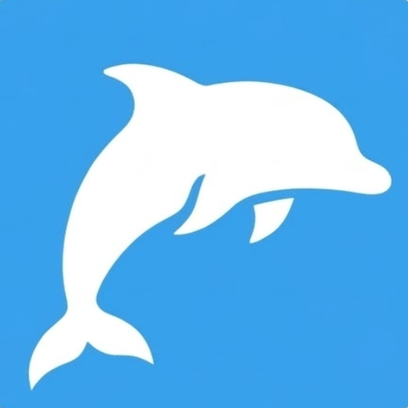

<a name="readme-top"></a>

<!-- SHIELDS -->
<div align="center">

[![Contributors][contributors-shield]][contributors-url]
[![Forks][forks-shield]][forks-url]
[![Stargazers][stars-shield]][stars-url]
[![Issues][issues-shield]][issues-url]
[![AGPL-3.0 License][license-shield]][license-url]

</div>

<!-- LOGO -->
<br />
<div align="center">
  <a href="https://github.com/Sonar-team/Sonar_desktop_app">
    
  </a>

  <h3 align="center">NetScan-AI</h3>

  <p align="center">
    AI-powered network traffic analyzer built with Rust and Tauri.<br/>
    Capture traffic, visualize flows, and control the app in natural language.
    <br />
    <br />
    <a href="https://github.com/Sonar-team/Sonar_desktop_app/issues/new?labels=bug">Report Bug</a>
    &nbsp;·&nbsp;
    <a href="https://github.com/Sonar-team/Sonar_desktop_app/issues/new?labels=enhancement">Request Feature</a>
  </p>
</div>

---

<!-- TABLE OF CONTENTS -->
<details>
  <summary>Table of Contents</summary>
  <ol>
    <li><a href="#about-the-project">About The Project</a></li>
    <li><a href="#built-with">Built With</a></li>
    <li>
      <a href="#getting-started">Getting Started</a>
      <ul>
        <li><a href="#prerequisites">Prerequisites</a></li>
        <li><a href="#installation">Installation</a></li>
      </ul>
    </li>
    <li><a href="#usage">Usage</a></li>
    <li><a href="#roadmap">Roadmap</a></li>
    <li><a href="#contributing">Contributing</a></li>
    <li><a href="#license">License</a></li>
    <li><a href="#contact">Contact</a></li>
    <li><a href="#acknowledgments">Acknowledgments</a></li>
  </ol>
</details>

---

<!-- ABOUT THE PROJECT -->
## About The Project

NetScan-AI is a fork of [Sonar][sonar-url], an open-source desktop application for network traffic capture and flow matrix generation. It extends Sonar's solid capture engine with an integrated AI assistant and an interactive network graph.

**Key features:**

### AI Assistant
- **Integrated chat panel** — VS Code-style sidebar (toggle with `Ctrl+I`)
- **Multi-provider support** — Anthropic (Claude), OpenAI (GPT-4o), Google Gemini, LM Studio (local, no API key), and any OpenAI-compatible endpoint
- **Tool calling** — the AI can start/stop/reset capture, apply or clear BPF filters, read and summarize the flow matrix, and export to CSV
- **CORS bypass** — HTTP calls to local servers are routed through a Rust proxy, so LM Studio works out of the box

### Network Capture Engine
- Promiscuous-mode capture on the selected interface with real-time flow matrix reconstruction
- BPF filter builder with preset rules and live preview
- Import `.pcap` files for offline analysis
- Automatic PCAP recording to the Downloads folder on session start
- Protocol support: Ethernet/MAC, VLAN 802.1Q, IPv4, IPv6, ARP, ICMPv4/v6, UDP, TCP, HTTP, DNS, TLS, QUIC

### Network Graph
- Force-directed layout with toggleable gravity
- **Device fingerprinting** — nodes are auto-identified by MAC OUI and IP heuristics and display a matching icon (Router/Switch, Server, PC, Mobile, Apple, Windows, Linux/RPi, Printer, VM, Internet)
- Colored ring per node: private vs. public address
- Manual type override and label editing from the info panel
- Export graph as PNG or SVG

### Export & Rules
- **CSV** — full flow matrix as a spreadsheet
- **Snort rules** — `.rules` file from captured flows
- **Suricata rules** — `.rules` file with metadata headers
- **iptables script** — bash ACCEPT rules for observed traffic

<p align="right">(<a href="#readme-top">back to top</a>)</p>

---

<!-- BUILT WITH -->
## Built With

[![Tauri][Tauri-badge]][Tauri-url]
[![Vue.js][Vue-badge]][Vue-url]
[![Rust][Rust-badge]][Rust-url]
[![TypeScript][TypeScript-badge]][TypeScript-url]

<p align="right">(<a href="#readme-top">back to top</a>)</p>

---

<!-- GETTING STARTED -->
## Getting Started

### Prerequisites

Install the system-level packet capture library for your platform.

#### Linux (Debian / Ubuntu)

```bash
sudo apt install libpcap-dev
```

After building, grant network capabilities to the binary (re-run after each recompile):

```bash
sudo setcap cap_net_raw,cap_net_admin=eip src-tauri/target/debug/netscan-ai
```

#### NixOS

A `shell.nix` is provided at the repository root — it includes `libpcap` and `libcap`:

```bash
nix-shell
sudo setcap cap_net_raw,cap_net_admin=eip src-tauri/target/debug/netscan-ai
```

#### Windows

1. Install **[NPcap][npcap-url]** (select "WinPcap API-compatible mode").
2. Install the **[WinPcap Developer Pack][winpcap-dev-url]**.
3. Add the `/Lib` or `/Lib/x64` folder to the `LIB` environment variable.

#### macOS

`libpcap` is bundled with macOS — no additional setup required.

---

### Installation

1. Clone the repository:
   ```bash
   git clone https://github.com/Sonar-team/Sonar_desktop_app.git
   cd Sonar_desktop_app
   ```

2. Install frontend dependencies:
   ```bash
   npm install
   ```

3. Start the app in development mode:
   ```bash
   npm run tauri dev
   ```

<p align="right">(<a href="#readme-top">back to top</a>)</p>

---

<!-- USAGE -->
## Usage

1. **Select a network interface** from the dropdown in the capture panel.
2. **Start capture** — click the ▶ button or ask the AI: *"Start capture"*.
3. **Watch the graph** — nodes and edges appear as traffic flows are detected. Hover a node to see its fingerprinted device type.
4. **Ask the AI** — open the sidebar (`Ctrl+I`) and type in natural language:
   - *"What hosts are communicating the most?"*
   - *"Apply a filter for TCP port 443"*
   - *"Export the flow matrix to CSV"*
5. **Build a BPF filter** — click the Filter button for a guided builder with presets.
6. **Export rules** — use the toolbar dropdown to generate Snort, Suricata, or iptables rules from the captured flows.
7. **Import a PCAP** — use the Import panel to load an existing `.pcap` file for offline analysis.

<p align="right">(<a href="#readme-top">back to top</a>)</p>

---

<!-- ROADMAP -->
## Roadmap

- [x] Multi-provider AI assistant (Anthropic, OpenAI, Gemini, LM Studio)
- [x] AI tool calling (start/stop capture, BPF filters, flow matrix query, CSV export)
- [x] Force-directed network graph with device fingerprinting
- [x] BPF filter builder
- [x] Snort / Suricata / iptables rule export
- [x] PCAP import and automatic recording
- [ ] Anomaly detection — flag unusual traffic patterns automatically
- [ ] Traffic classification — identify applications with ML models
- [ ] Flow prediction — anticipate network behaviour over time

See the [open issues][issues-url] for a full list of proposed features and known bugs.

<p align="right">(<a href="#readme-top">back to top</a>)</p>

---

<!-- CONTRIBUTING -->
## Contributing

Contributions are what make the open-source community such an amazing place to learn, inspire, and create. Any contributions you make are **greatly appreciated**.

If you have a suggestion that would improve this project, please fork the repository and create a pull request. You can also open an issue with the label `enhancement`.

1. Fork the Project
2. Create your Feature Branch (`git checkout -b feature/AmazingFeature`)
3. Commit your Changes (`git commit -m 'Add some AmazingFeature'`)
4. Push to the Branch (`git push origin feature/AmazingFeature`)
5. Open a Pull Request

<p align="right">(<a href="#readme-top">back to top</a>)</p>

---

<!-- LICENSE -->
## License

Distributed under the **AGPL-3.0** License. See [`LICENSE.md`](LICENSE.md) for more information.

<p align="right">(<a href="#readme-top">back to top</a>)</p>

---

<!-- CONTACT -->
## Contact

Project Link: [https://github.com/Sonar-team/Sonar_desktop_app][repo-url]

<p align="right">(<a href="#readme-top">back to top</a>)</p>

---

<!-- ACKNOWLEDGMENTS -->
## Acknowledgments

* [Sonar][sonar-url] — the upstream project this fork is based on
* [Tauri][Tauri-url] — the framework that makes cross-platform Rust + web UI possible
* [v-network-graph](https://dash14.github.io/v-network-graph/) — force-directed graph component for Vue
* [libpcap](https://www.tcpdump.org/) / [NPcap][npcap-url] — packet capture libraries
* [Best-README-Template](https://github.com/othneildrew/Best-README-Template) — README structure

<p align="right">(<a href="#readme-top">back to top</a>)</p>

---

<!-- REFERENCE-STYLE LINKS & BADGES -->
[contributors-shield]: https://img.shields.io/github/contributors/Sonar-team/Sonar_desktop_app.svg?style=for-the-badge
[contributors-url]: https://github.com/Sonar-team/Sonar_desktop_app/graphs/contributors
[forks-shield]: https://img.shields.io/github/forks/Sonar-team/Sonar_desktop_app.svg?style=for-the-badge
[forks-url]: https://github.com/Sonar-team/Sonar_desktop_app/network/members
[stars-shield]: https://img.shields.io/github/stars/Sonar-team/Sonar_desktop_app.svg?style=for-the-badge
[stars-url]: https://github.com/Sonar-team/Sonar_desktop_app/stargazers
[issues-shield]: https://img.shields.io/github/issues/Sonar-team/Sonar_desktop_app.svg?style=for-the-badge
[issues-url]: https://github.com/Sonar-team/Sonar_desktop_app/issues
[license-shield]: https://img.shields.io/github/license/Sonar-team/Sonar_desktop_app.svg?style=for-the-badge
[license-url]: https://github.com/Sonar-team/Sonar_desktop_app/blob/main/LICENSE.md
[repo-url]: https://github.com/Sonar-team/Sonar_desktop_app
[sonar-url]: https://github.com/Sonar-team/Sonar_desktop_app

[Tauri-badge]: https://img.shields.io/badge/Tauri-24C8DB?style=for-the-badge&logo=tauri&logoColor=white
[Tauri-url]: https://tauri.app/
[Vue-badge]: https://img.shields.io/badge/Vue.js-35495E?style=for-the-badge&logo=vuedotjs&logoColor=4FC08D
[Vue-url]: https://vuejs.org/
[Rust-badge]: https://img.shields.io/badge/Rust-000000?style=for-the-badge&logo=rust&logoColor=white
[Rust-url]: https://www.rust-lang.org/
[TypeScript-badge]: https://img.shields.io/badge/TypeScript-007ACC?style=for-the-badge&logo=typescript&logoColor=white
[TypeScript-url]: https://www.typescriptlang.org/

[npcap-url]: https://npcap.com/
[winpcap-dev-url]: https://www.winpcap.org/devel.htm
